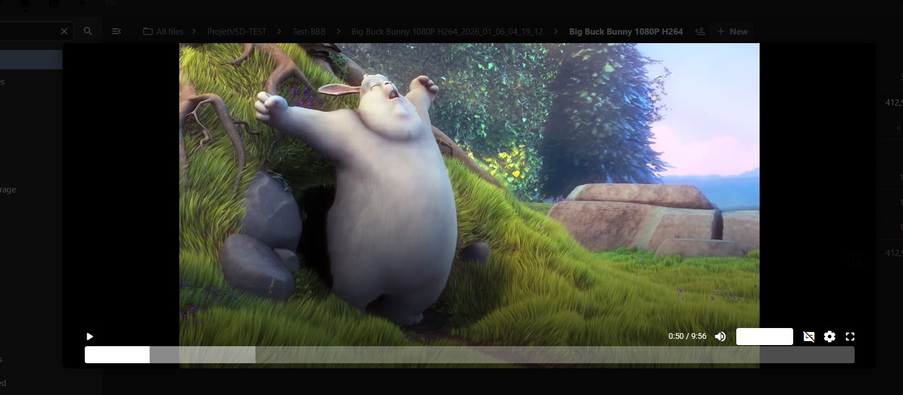

# User Guide - PLAYER

This module allows you to watch transcoded videos directly in your browser, automatically adjusting quality based on your connection speed.

## 1. Watching a Video (Internal Use)

To watch a video from your Nextcloud account:

1. Go to the **Files** app.
2. Navigate to the folder containing your converted video.
3. Locate the **`.mpd`** (DASH) or **`.m3u8`** (HLS) manifest file.
4. **Click on the file**: the player opens in a dedicated viewer.

### Player Features

The player uses **Shaka Player** to ensure a smooth experience:

* **Auto Quality:** The video adapts to your internet speed.
* **Manual Selection:** Click the ⚙️ (gear icon) to force a specific resolution (e.g., 1080p, 720p).
* **Subtitles:** Click the 💬 (bubble icon) to enable/disable subtitles (if available).
* **Exit the player:** Clicking outside the player area closes/exits the viewer.

## 2. Sharing a Video (Public)

You can share a video with people who do not have a Nextcloud account.

### Steps

1. In **Files**, share the **entire folder** that contains:
    - the `.mpd` and/or `.m3u8` manifest,
    - the associated video segments,
    - and, if present, the subtitle files.
2. Create a **public link** for this folder.
3. Send the link to your recipient.

**Important:** The public link works when the **full folder** containing the required files is shared. Sharing only the file may not enable playback.

### On the recipient side

1. The recipient opens the public folder link.
2. They **click the file** `Film.mpd` or `Film.m3u8`.
3. The player opens and the video can be watched.

## 3. Quick Troubleshooting

* **The public link downloads a file** (`.mpd` or `.m3u8`) instead of opening the player: this is usually a bad sign. It may indicate that the player is not correctly associated with the file type, or that the share does not include the full folder.

## 4. About

Application **tested on Nextcloud 32**.

PFE team:
* Simon Bigonnesse
* Abdessamad Cherifi
* Clément Deffes
* Nicolas Thibodeau (Team lead)

Supervised by **Stéphane Coulombe**.
